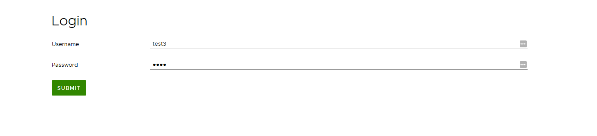
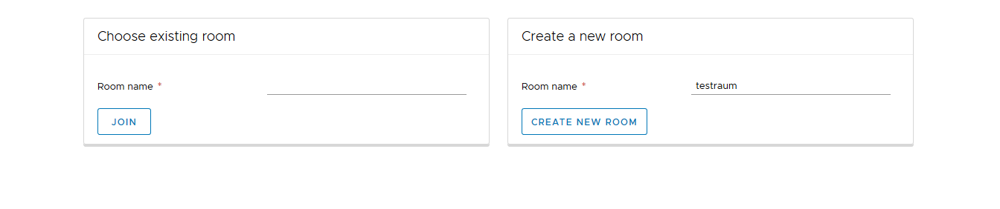
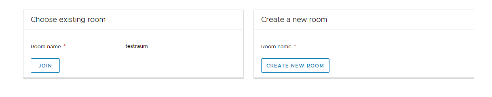
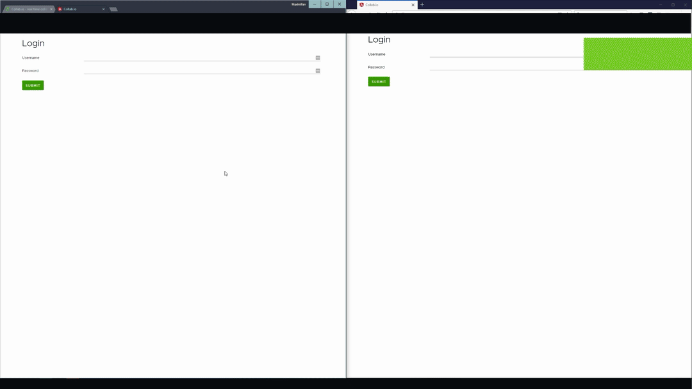

# Welcome to our collab.io project 👋

We implemented this project in our second year of the master's programme in the University
of Applied Sciences Hagenberg in Austria. The great part about the programme back then was
that students could pretty much choose freely what they wanted to do as a project as long
as it's technically challenging.

We decided to create a drawing platform ourselves which transmits everything drawn in
realtime over websockets, so you can collaborate on your scribbles. Of course there were
solutions like this already but only from very big companies like Google. We wanted to
look into the technology and implement this ourselves.

If you want to read the full paper we submitted for this project you can access it
[here](docs/collab-io-documentation.pdf).

## Architecture

I'll quickly go over some cool stuff that makes this project special. We really treated
this project as some playground to try out new stuff, not only implementing the renderer
ourselves, but also playing around what is possible with websockets and general web
technology.

## Renderer ⚙️

The renderer of this application was implemented by scratch with three.js. This is the
reason it made it easy for us to just submit all drawn data via some websocket connection.

Due to the renderer being implemented from the ground up and also due to implementing
everything with rxjs we could just merge all our incoming streams of data to accomplish a
multi-user drawing experience.

The following screenshot shows, that every stroke is rendered as a three stroke.

## Websocket connection ⚡

The real cool thing about this application is the fact that you can scribble in your room
and send and receive data from other participants in real time. We tested this and the
performance is extraordinarily fast.

Due to using reactive programming with three.js implementing the realtime functionality
was literally a breeze. We only needed to merge the local and the socket incoming streams
together. Nothing else was needed to make the renderer work which was an amazing
experience for us 😄

Of course we also needed to send out the local events, but this was not that hard either.
Instead of one stream consumer (renderer) we now had two. The socket consumer simply sends
out all locally produced data do the connected room.

If you want to look at the code you might start
[here](https://github.com/MaxSquared-WebCraft/collab.io/blob/c978a49337416fe788101fc290cd80491094f567/src/app/three/three.component.ts#L128)

## Rooms 🤝

The system is implemented, so you can create users and different rooms. If you know the
room's name you can simply join it to being able to collaborate. Due to time constraints
we decided to not implement some room-user connection auth features.

|         Login         |    Creating a room    |    Joining a room     |
| :-------------------: | :-------------------: | :-------------------: |
|  |  |  |

## Demo 👀

In the following gif we show you how the application looks like. There are actually 3
clients involved in the demo. The GIF shows two simultaneously opened windows but Max
opened the third window in his room. I created a room, we all joined the same room and
started scribbling away ✏️

## Server

If you want to see the server implementation documentation go to the server repository.
